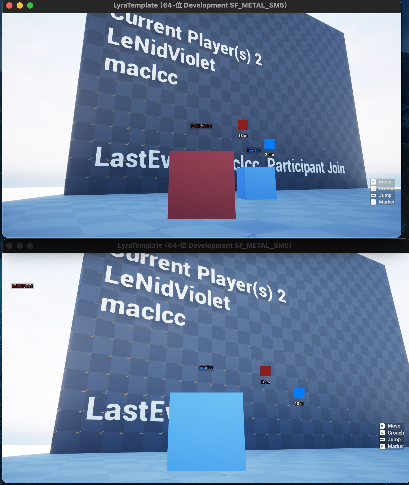

# Lyra Template for Unreal Engine 5

Unreal Engine Version: 5.7.0 (Source Build)

Lyra Version: Compatible with UE 5.7

Macos 15.7.1 / Rider 2025.3

⸻⸻⸻⸻⸻⸻⸻⸻⸻⸻

This branch includes partial modifications to the Lyra source code.  
For detailed information, please refer to the commit history.

⸻⸻⸻⸻⸻⸻⸻⸻⸻⸻
### The following features support both single-player and multiplayer modes. Requires manual configuration of EOS (Epic Online Services) settings.
* Basic rotation and pickup interaction via GAS.
* Marker functionality (via GAS) and nameplate features.

