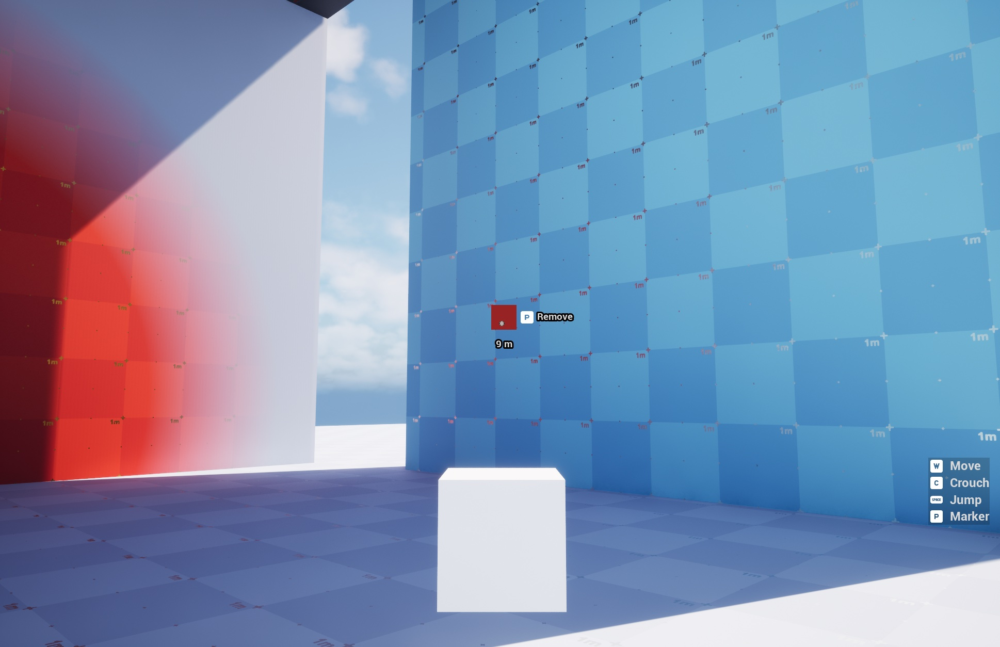
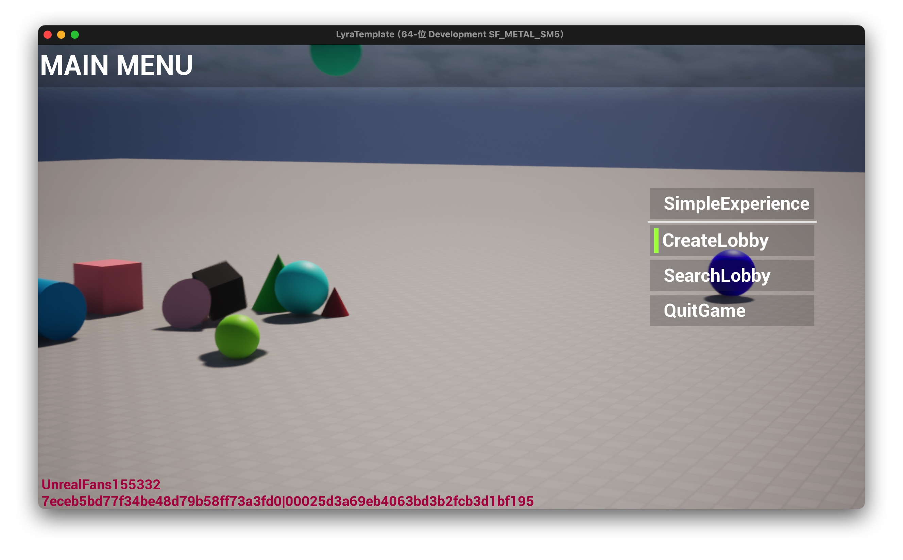
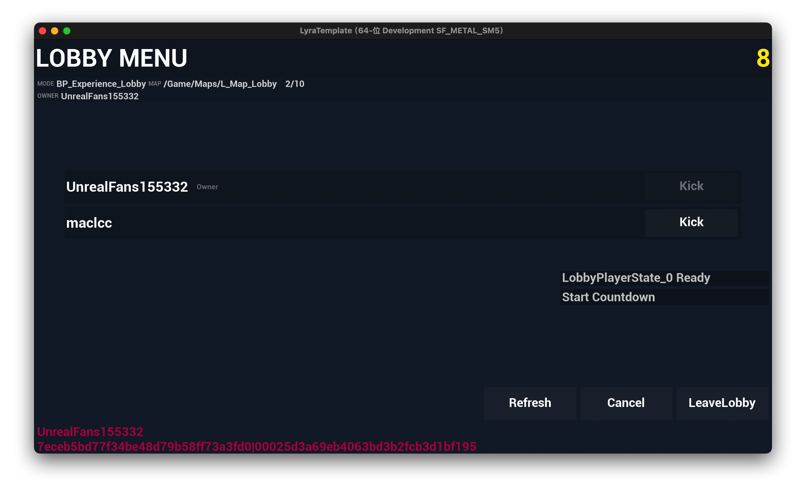
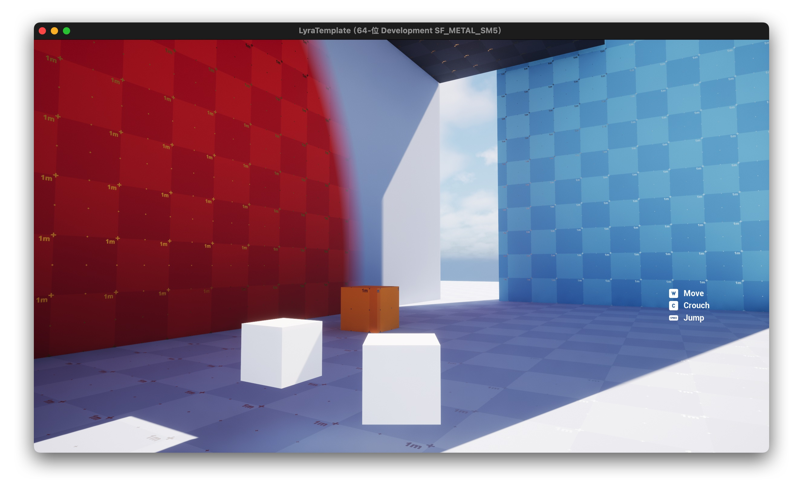

# Lyra Template for Unreal Engine 5

Unreal Engine Version: 5.6.1 (Source Build)

Lyra Version: Compatible with UE 5.6

Macos / Rider

⸻⸻⸻⸻⸻⸻⸻⸻⸻⸻

This branch includes partial modifications to the Lyra source code.  
For detailed information, please refer to the commit history.

⸻⸻⸻⸻⸻⸻⸻⸻⸻⸻
## Marker 
This branch enhances Lyra’s marker feature with some modifications to the original source.
See the commit history for details.

⸻⸻⸻⸻⸻⸻⸻⸻⸻⸻

## Multiplayer Lobby (OSSv1) - Basic Functionality

This branch provides the basic functionality for creating a multiplayer lobby and hosting games using **OSSv1** with a **local listen server**.

To run the project properly with **Epic Online Services (EOS)**, please follow the setup guide below:

🔗 [Using Epic Online Services with Lyra Starter Game](https://dev.epicgames.com/community/learning/tutorials/375e/unreal-engine-using-epic-online-services-with-lyra-starter-game)

### Setup Instructions
1. **Create and configure your EOS developer account**  
   Follow the steps in the guide to register and set up your EOS project.

2. **Add your EOS application credentials to the project configuration**  
   Update your `DefaultEngine.ini` with your EOS application information.  
   *(Recommended location: `Config/Custom/EOS/DefaultEngine.ini`)*

⸻⸻⸻⸻⸻⸻⸻⸻⸻⸻

